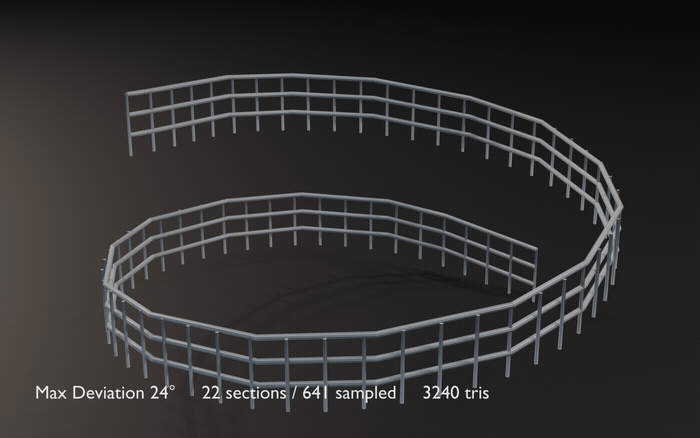
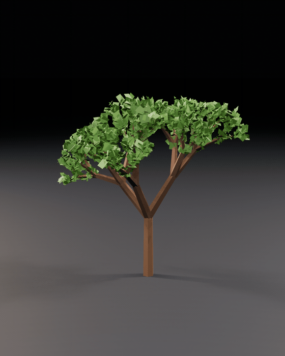
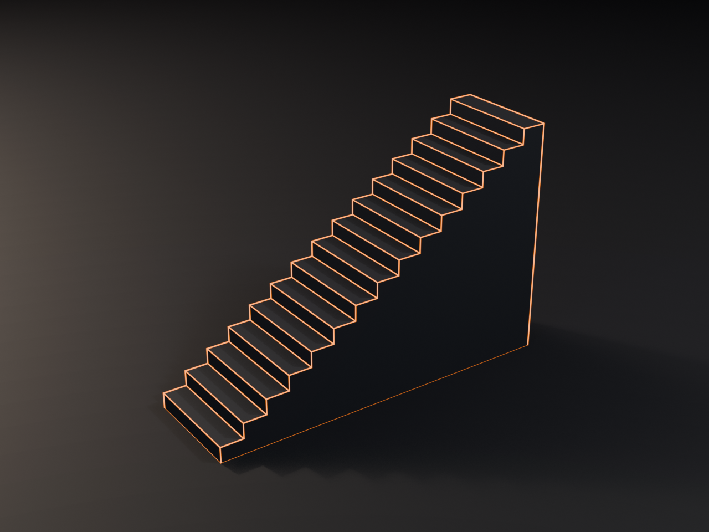
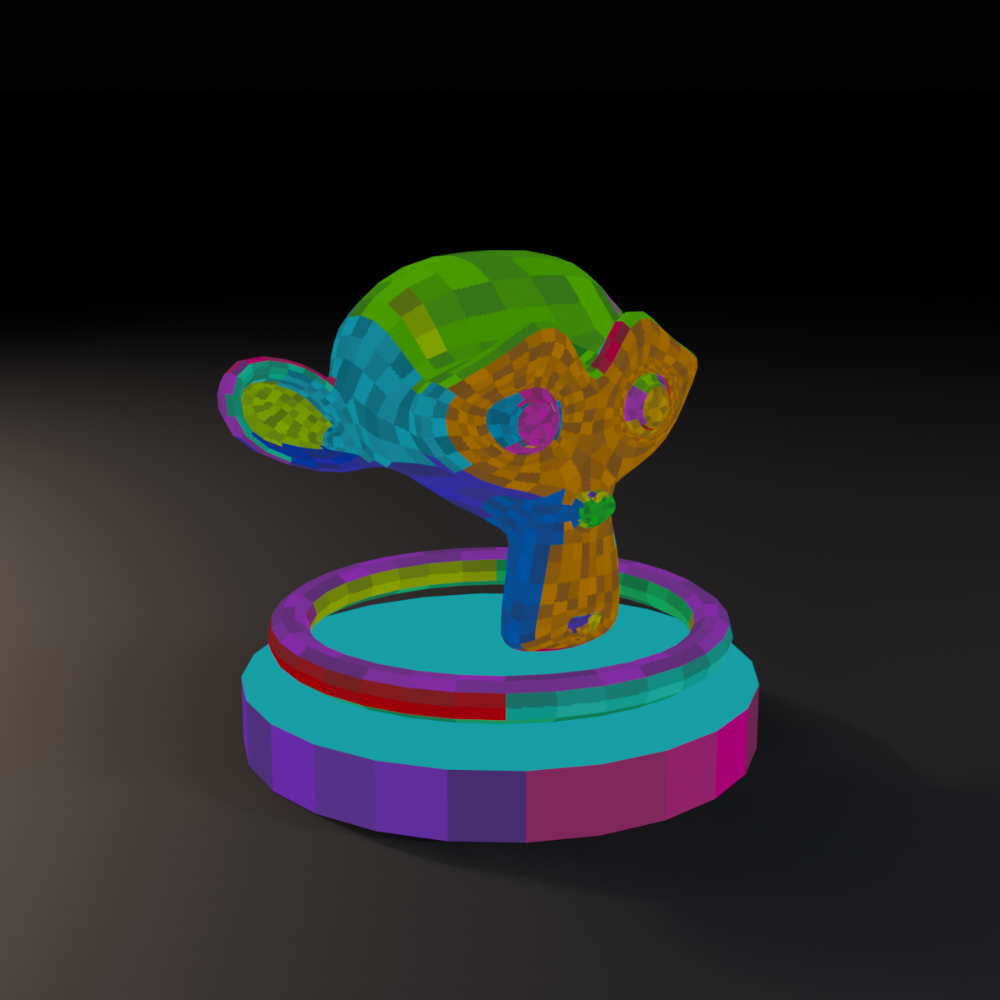

# Blender Add-ons

Mes add-ons Blender perso : six générateurs de géométrie procédurale, un bake de Color ID map,
un raccourci d'édition. Testés sur Blender 5.1.

**→ [Guide illustré complet](docs/GUIDE.md)** — ce que fait chaque add-on, en images et en GIFs.

| Add-on | Ce que ça fait | Onglet | Blender | Dossier |
|---|---|---|---|---|
| [Stair Generator](stair-generator/) | Escalier plein manifold, piloté par angle ou par hauteur de marche | Stairs | 4.5+ | `stair-generator/` |
| [Curve Railing Generator](curve-railing-generator/) | Rambarde le long d'un tracé, tessellation adaptative à la courbure | Railing | 4.5+ | `curve-railing-generator/` |
| [Low Poly Hex Tree](low-poly-hex-tree/) | Arbre low poly procédural, réglages par niveau de branchement | Tree | 4.2+ | `low-poly-hex-tree/` |
| [Noise Surface Generator](noise-surface-generator/) | Terrain fBm temps réel, mode tileable sans couture | Noise Surface | 4.0+ | `noise-surface-generator/` |
| [Cube Ring Generator](cube-ring-generator/) | Anneau de cubes aléatoires, UVs en espace monde | Cube Ring | 4.5+ | `cube-ring-generator/` |
| [Blade Profile Generator](blade-profile-generator/) | Lame d'épée : profil de largeur, émouture, gorge | Blade | 4.5+ | `blade-profile-generator/` |
| [Color ID Map Generator](color-id-map-generator/) | Bake d'une Color ID map par îlot UV et par face | Color ID | 4.5+ | `color-id-map-generator/` |
| [Origin to Selection](origin-to-selection/) | `Ctrl+Alt+C` : origine au centre de la sélection | — | 4.2+ | `origin-to-selection/` |

  
  

  
  

## Installation

**Scripts `.py`** (tous sauf Origin to Selection) : `Edit > Preferences > Add-ons` > menu ▾ >
`Install from Disk`, sélectionner le `.py` du dossier voulu, puis cocher la case.

**Extension** (Origin to Selection) : zipper le dossier `origin-to-selection/` et l'installer
de la même façon.

Les panneaux apparaissent dans la sidebar de la vue 3D (touche **N**), chacun sur son onglet.

## Notes

Les scripts ont été rassemblés depuis mes installations Blender 4.5 et 5.1 pour sauvegarde et
maintenance. Pour les add-ons présents en plusieurs copies, la version la plus récente a été
retenue.
