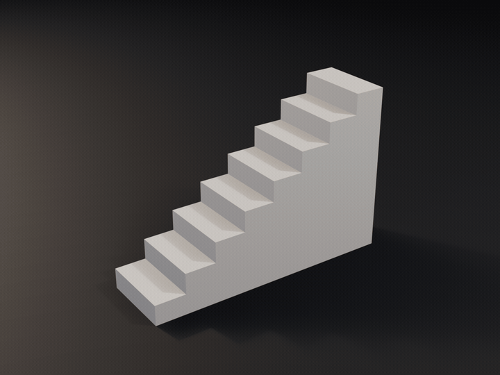
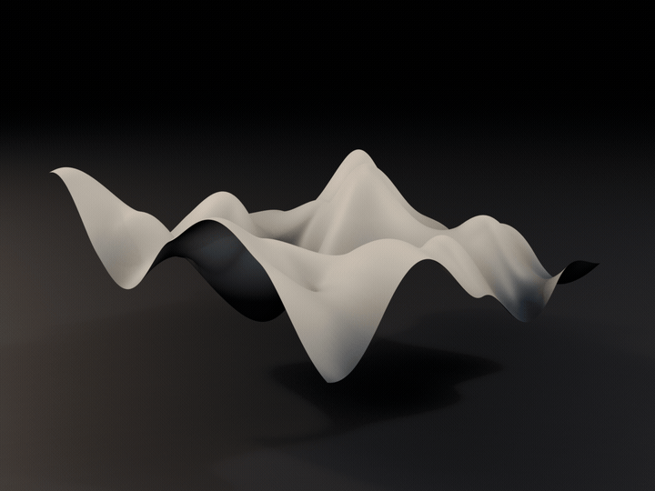
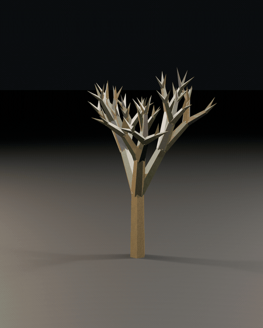
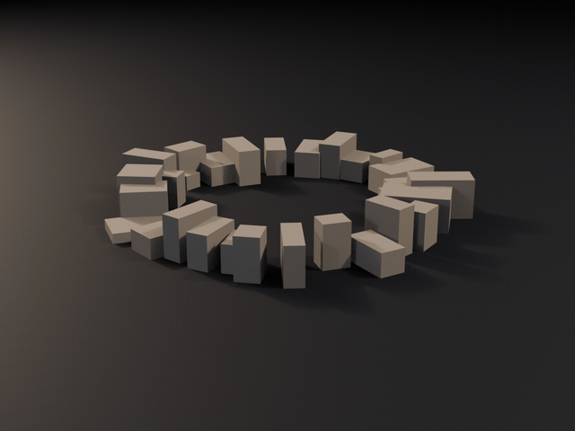
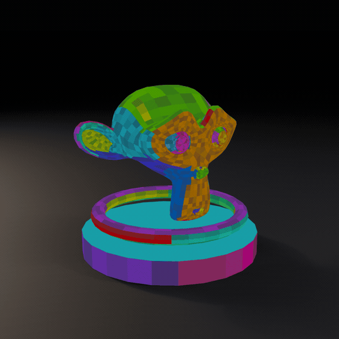

# Blender Add-ons

My personal Blender add-ons: five procedural geometry generators, a Color ID map baker, and one
editing shortcut. Tested on Blender 5.1.

**→ [Full illustrated guide](docs/GUIDE.md)** — what each add-on does, in stills and GIFs.

| Add-on | What it does | Tab | Blender | Folder |
|---|---|---|---|---|
| [Stair Generator](stair-generator/) | Solid manifold staircase, driven by slope angle or riser height | Stairs | 4.5+ | `stair-generator/` |
| [Curve Railing Generator](curve-railing-generator/) | Railing along a path, curvature-adaptive tessellation | Railing | 4.5+ | `curve-railing-generator/` |
| [Low Poly Hex Tree](low-poly-hex-tree/) | Procedural low poly tree, per-level branching settings | Tree | 4.2+ | `low-poly-hex-tree/` |
| [Noise Surface Generator](noise-surface-generator/) | Real-time fBm terrain, seamless tileable mode | Noise Surface | 4.0+ | `noise-surface-generator/` |
| [Cube Ring Generator](cube-ring-generator/) | Ring of random cubes, world-space UVs | Cube Ring | 4.5+ | `cube-ring-generator/` |
| [Color ID Map Generator](color-id-map-generator/) | Bake a Color ID map per UV island and per face | Color ID | 4.5+ | `color-id-map-generator/` |
| [Origin to Selection](origin-to-selection/) | `Ctrl+Alt+C`: origin to the center of the selection | — | 4.2+ | `origin-to-selection/` |

  
  
  

  
  
  

## Installation

**`.py` scripts** (everything except Origin to Selection): `Edit > Preferences > Add-ons` >
▾ menu > `Install from Disk`, pick the `.py` inside the folder you want, then tick its checkbox.

**Extension** (Origin to Selection): zip the `origin-to-selection/` folder and install it the
same way.

Panels show up in the 3D view sidebar (**N** key), each on its own tab.

## Notes

These scripts were gathered from my Blender 4.5 and 5.1 installs for backup and maintenance.
Where an add-on existed in several copies, the most recent version was kept.
