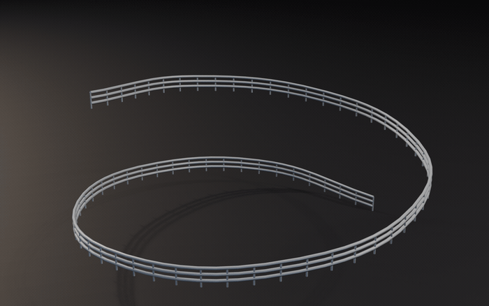
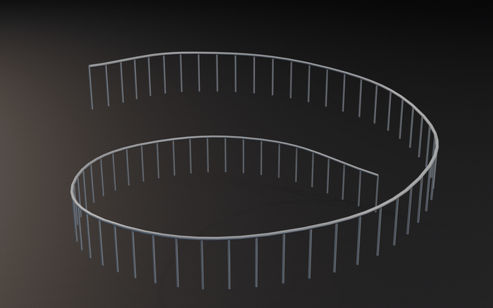
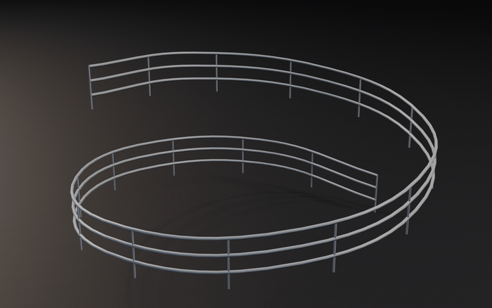
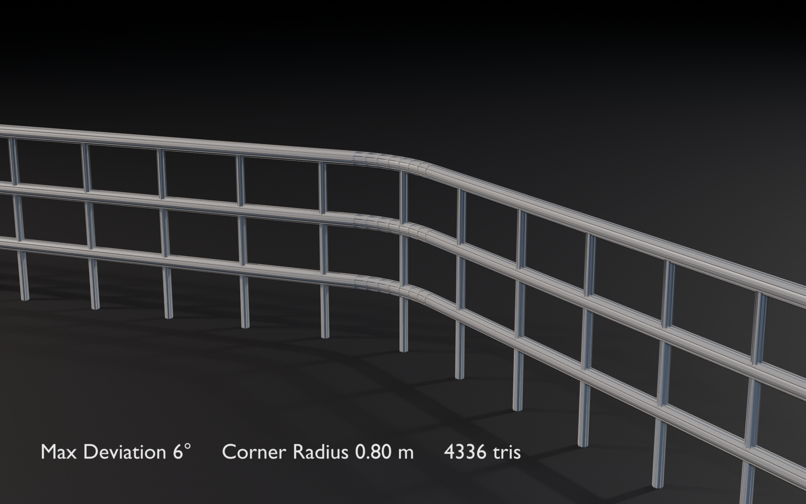
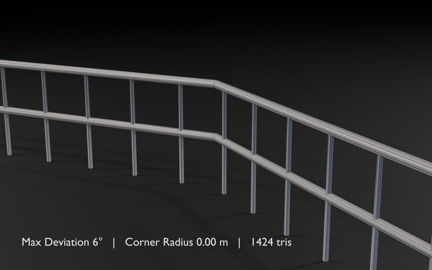
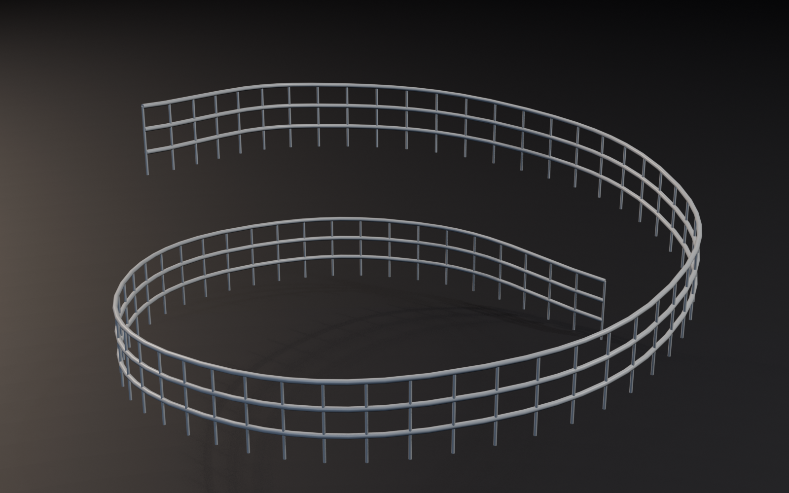

# Curve Railing Generator

Generates a railing (handrail + posts) along a path, with **curvature-adaptive tessellation**:
geometry in the corners, almost nothing on the straight runs.

Two ways to lay out a path, detected automatically from the spline type:

- **Control points** (POLY curve, or Bézier with Vector handles) — the recommended mode for a
  railing. You just drop points, "the rail goes from here to there, then changes direction",
  and every corner is rounded off on its own by a **circular arc** of the radius you asked for.
  No handles, no weights to manage.
- **Bézier curve** — for genuinely curved layouts (a racetrack, a helical ramp). The curve is
  densely sampled, then simplified by angular deviation.

- Author: Muware
- Version: 1.2.0
- Blender: 4.5.0+
- Category: Add Mesh
- Location: View3D > Sidebar (N) > **Railing**
- File: `curve_railing_generator.py`

## Usage

1. *Railing* panel > **New Railing Path**: creates a 2-point path at the 3D cursor along with
   its railing, and drops you into Edit Mode on the path with the last point selected.
2. **E** to extrude the next point, as many times as needed. Every corner rounds itself off.
3. Tweak the settings in the panel; it regenerates live.

The panel stays usable while editing the path: selecting the curve shows its railing's
settings. The **Edit Path** button takes you back there from the railing.

**Freeze** cuts the link with the generator: the mesh is kept as is, it stops following its
path, and the add-on no longer recognizes it. This is one-way (Ctrl+Z to undo), and the
settings are lost. The path is not deleted — if it is no longer useful the info message says
so, and you delete it yourself.

To start from an existing curve: select it, then **From Active Curve**.

The curve gives the **base line** (on the ground): the handrail sits `Height` above it, and the
posts run from the ground up to the handrail axis.

Settings are stored **on the object**: every railing keeps its own, and Shift+D gives a copy
you can edit independently.

With **Live Update** on, the railing regenerates both on a settings change and while editing
the curve: moving a control point in Edit Mode updates the railing in real time
(`depsgraph_update_post` handler). The **Rebuild** button is still there to force a rebuild.

## Parameters

**Handrail** — axis height, tube radius, radial resolution, and number of horizontal rails
(`Rails` > 1 adds rails spread between the ground and the height).

**Posts** — target spacing (adjusted to land exactly on the curve length), radius, radial
resolution, and `Sink` to push them below the ground.

**Optimization** — the heart of the add-on:
- `Max Deviation`: the angular budget of one rail section. It is the only setting that really
  matters: lower = smoother corners and more triangles.
- `Corner Radius` (control-point mode): radius of the arc that rounds off each corner.
  Automatically shrunk on a corner whose neighbouring segments are too short, so two fillets
  never overlap. At 0, corners stay sharp.
- `Max Section` (curve mode): maximum length of a section on a straight run. It only exists to
  stop a perfectly straight line from becoming one gigantic edge.

The second setting shown depends on the detected mode — the other one would be inert.

**Result** — triangles, vertices, and how many sections were kept out of how many sampled
points (the compression ratio).

Measured figures:

| Path | Sections | Triangles |
|---|---|---|
| Right-angle L, sharp corners (`Corner Radius` 0) | 4 | 320 |
| Same, 0.6 m fillets at 8° | 28 | 684 |
| Same at 3° | 64 | 1260 |
| "Long straight + 90° turn" Bézier, adaptive at 8° | 16 | 472 |
| The same Bézier at equivalent uniform resolution | 161 | 2792 |

## Implementation notes

- Control-point mode: every corner becomes a **true circular arc** (not a Bézier
  approximation), cut into `ceil(angle / Max Deviation)` segments. The fillet therefore
  produces the right density directly — there is no later simplification pass to degrade it.
- Curve mode: dense sampling (64 points per Bézier segment) then simplification by accumulating
  the turn angle — the result depends only on the actual geometry, not on the sampling density.
- Fixed "up" frame for the tube sweep (no parallel transport): no accumulated twist, and a
  railing is always upright anyway.
- Tubes in smooth quads, caps as flat n-gons: per-face flat/smooth is enough, no auto-smooth
  and no modifier needed.
- Cyclic splines handled (closed railing, no caps).
- The mesh is rewritten in place (`clear_geometry` + `from_pydata`) rather than replaced: no
  datablock creation or deletion from a depsgraph handler, and it is faster.
- The curve is read from its evaluated copy, so curve modifiers and Edit Mode state are taken
  into account (falling back to the original data if the curve has a bevel, since it then
  evaluates to a mesh).
- NURBS splines are treated as control points (fillets), not evaluated as NURBS.

## Installation

Edit > Preferences > Add-ons > Install, pick `curve_railing_generator.py`, then enable it.

---

## Preview

Height, rail count, post spacing — all live:

  
  
  

`Max Deviation` from 24° to 2° on a helical ramp — 641 sampled points collapse to 76 sections at
6°, and the handrail still reads as smooth:

  
  

  
  

[Full illustrated guide](../docs/GUIDE.md#2-curve-railing-generator)
