# Add-on guide

Seven Blender add-ons, all tested on Blender 5.1 (and compatible with 4.x according to each
add-on's own spec). Five procedural geometry generators, one baking utility, one editing
shortcut.

Every image below is a real EEVEE render of the geometry the add-ons produce, not a mockup.

> **These add-ons are free and always will be.** If one of them saves you some time and you feel
> like supporting the work, you can buy me a coffee.
>
> 

## Installation

**`.py` scripts (classic add-ons)**, everything except Origin to Selection:
`Edit > Preferences > Add-ons` > ▾ menu (top right) > `Install from Disk`, pick the `.py` inside
the folder you want, then tick its checkbox.

**Extension (Origin to Selection)**: zip the `origin-to-selection/` folder, then
`Install from Disk` on the zip.

Each add-on puts its panel in the 3D view *sidebar* (**N** key), on its own vertical tab.

---

## 1. Stair Generator

Slope angle drives the going (`going = riser / tan(angle)`). Riser height drives the step count,
rounded so the total height lands exactly, so the actual riser is always an exact divisor of the
height you asked for.

  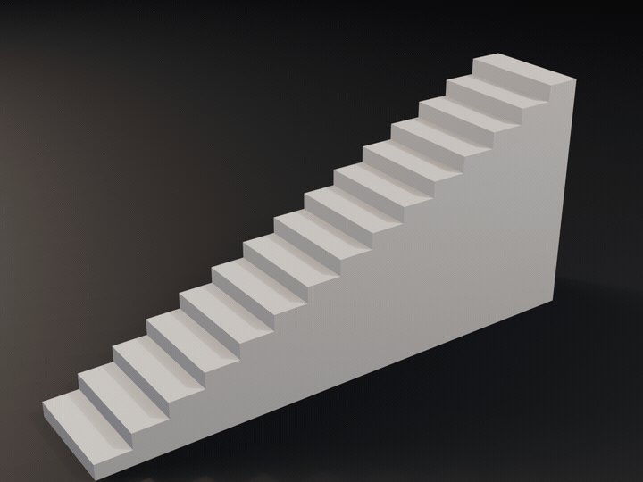
  

Solid, manifold, quads everywhere except the two side n-gons. No duplicate vertices, no interior
faces: 15 steps = 64 vertices, 34 faces, 32 of them quads. Exportable to a game engine as is.

  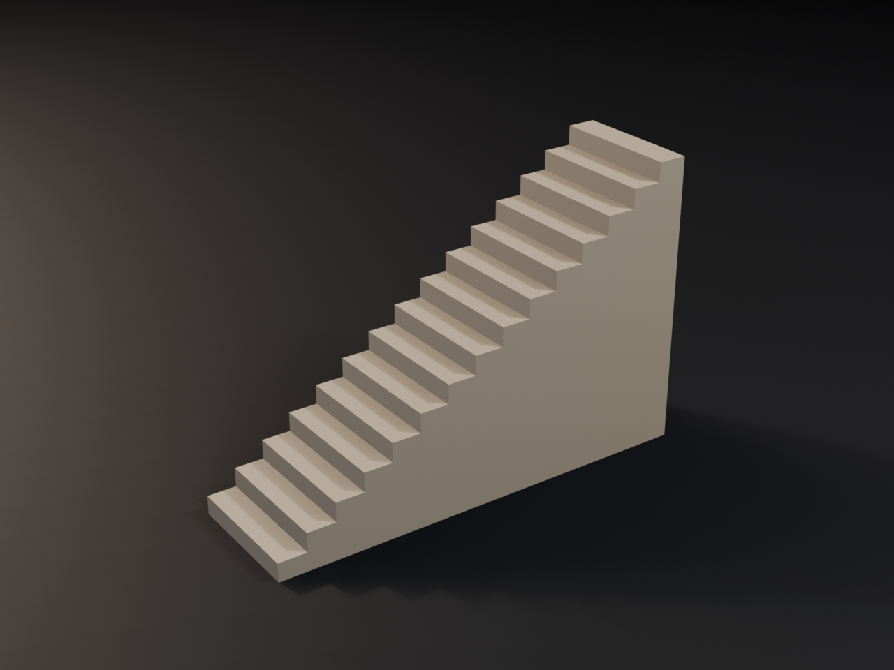
  
  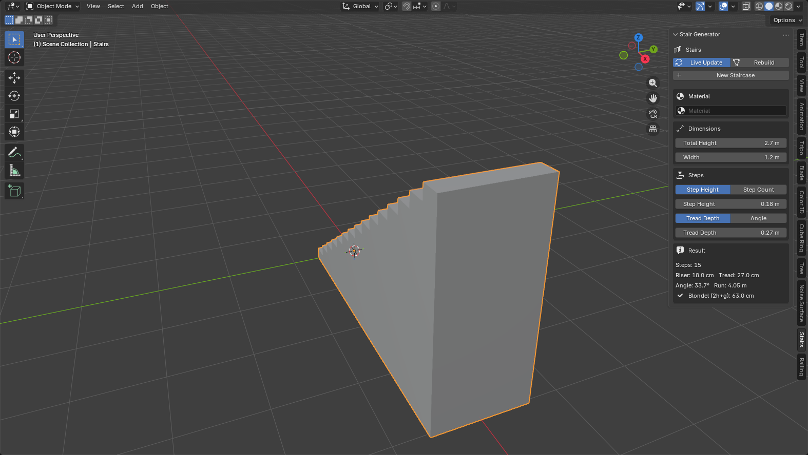

The *Result* panel shows the values actually built and checks Blondel's comfort formula
(2h + g between 60 and 64 cm).

**Stairs** tab · `stair-generator/stair_generator.py` · [README](../stair-generator/README.md)

---

## 2. Curve Railing Generator

Drop control points or hand it a curve, and you get a railing: handrail, horizontal rails,
posts. Everything is a live parameter: height, how many rails, how tight the posts are spaced.

  
  
  

**The point of the add-on is `Max Deviation`**, the angular budget of one rail section. It is
the only setting that really matters: the tessellation follows the curvature, so a straight run
costs two triangles and a tight turn gets exactly as many as it needs. On this helical ramp, 641
sampled points collapse to 76 sections at 6°, and the handrail still reads as perfectly smooth.

  
  

On a control-point path, every corner is rounded off by a **true circular arc** of the radius you
ask for, not a Bézier approximation, and no handles to manage. Corners whose neighbouring segments
are too short shrink their own fillet so two never overlap.

  
  

Measured figures on a "long straight + 90° turn" path:

| Path | Sections | Triangles |
|---|---|---|
| Right-angle L, sharp corners | 4 | 320 |
| Same, 0.6 m fillets at 8° | 28 | 684 |
| Same at 3° | 64 | 1260 |
| Adaptive Bézier at 8° | 16 | 472 |
| The same Bézier at equivalent uniform resolution | 161 | 2792 |

Settings live **on the object**, so Shift+D gives a copy you can edit independently. With *Live
Update* on, moving a control point in Edit Mode updates the railing in real time.

  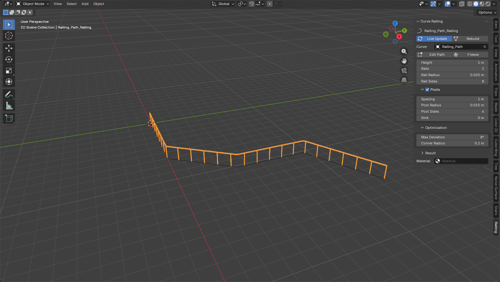

**Railing** tab · `curve-railing-generator/curve_railing_generator.py` · [README](../curve-railing-generator/README.md)

---

## 3. Low Poly Hex Tree

**Branch Depth** grows the tree one level at a time: 25 faces for the bare trunk, 3410 at five
levels. **Leaves per Branch** fills the crown. And one integer reshuffles everything: same
settings, sixteen seeds.

  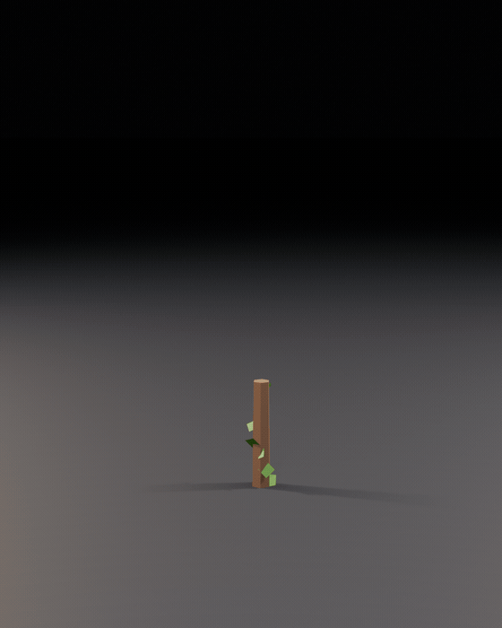
  
  

Sections are curved by parallel transport, so no twist ever accumulates along a branch. Foliage
is quads with box-projected UVs on the wood, so you can plug in your own bark and leaf atlas and it takes
them straight away.

  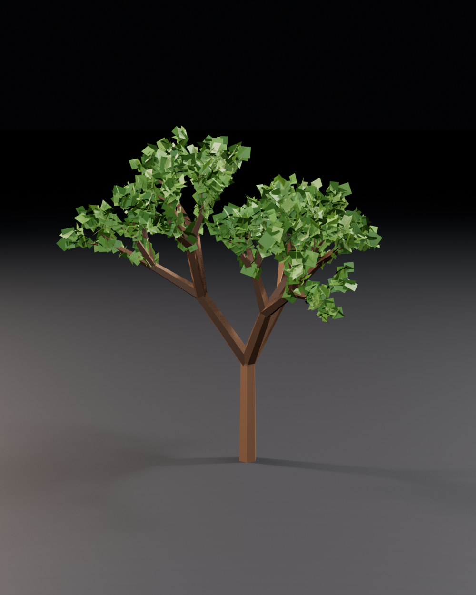
  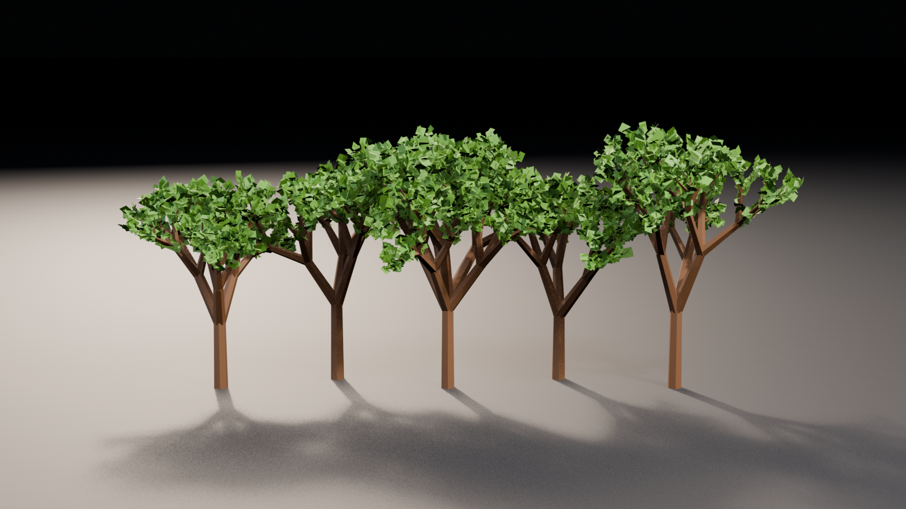

Every branching level has its own settings (branch count, polygon sides, sections, taper, curve
noise), copyable from one level to all the others in one click.

  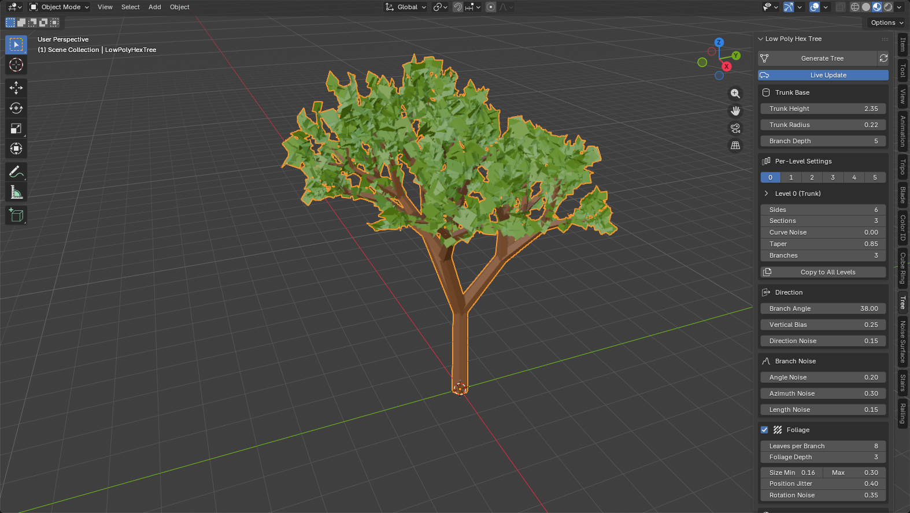

**Tree** tab · `low-poly-hex-tree/low_poly_hex_tree.py` · [README](../low-poly-hex-tree/README.md)

---

## 4. Noise Surface Generator

**Octaves stack detail**: one gives big soft hills, six gives a full relief, each octave adding
a frequency twice as high at half the amplitude. **Scale sets feature size**, from mountain
range down to pebble.

  
  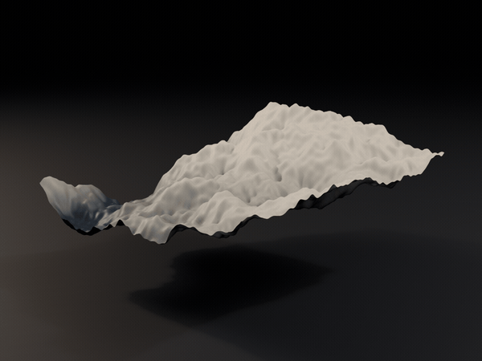

**Seamless mode** samples the noise on a 4D torus: since a circle closes on itself, the surface
is identical along opposite edges. Below, the same tile repeated 3×3, with no seam.

  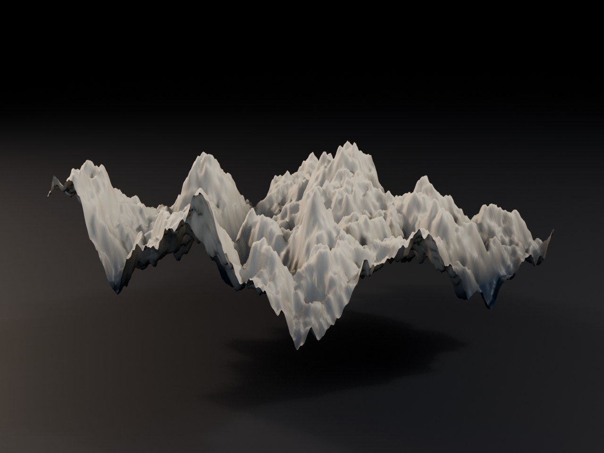
  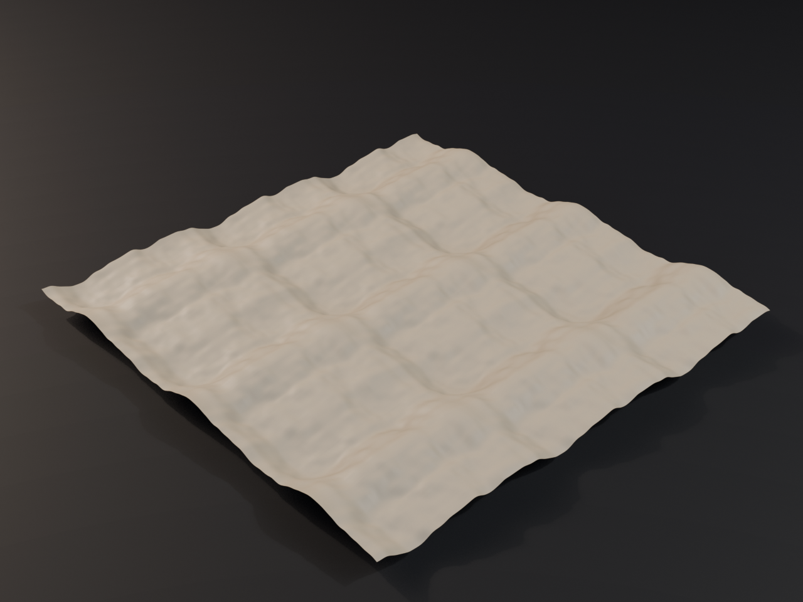
  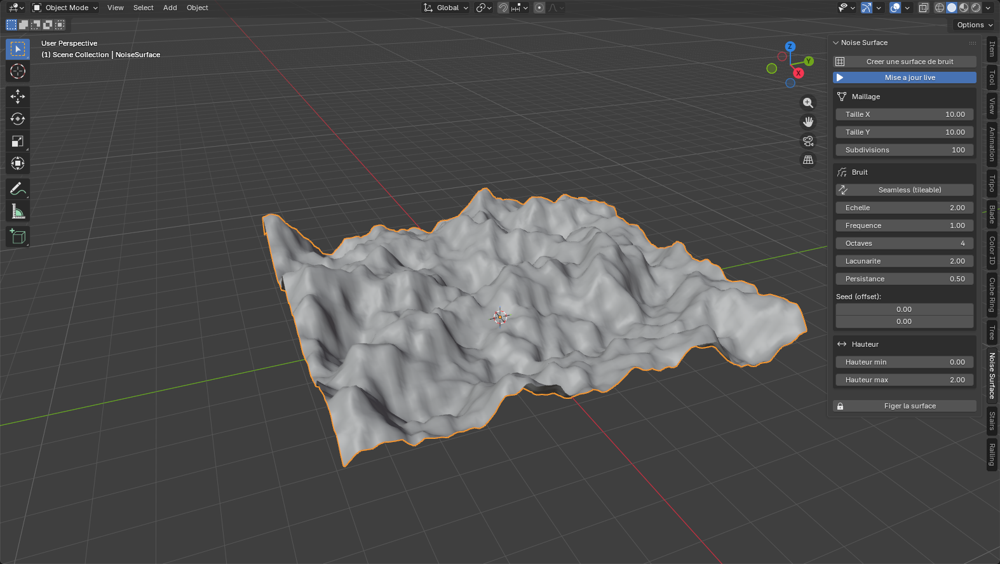

Everything is tweakable in real time, then *Freeze Surface* turns the result into a standard
mesh.

**Noise Surface** tab · `noise-surface-generator/noise_surface_generator.py` · [README](../noise-surface-generator/README.md)

---

## 5. Cube Ring Generator

Cube count from 8 to 60, the seed to reroll the distribution, and lateral noise to go from tidy
ring to field of rubble.

  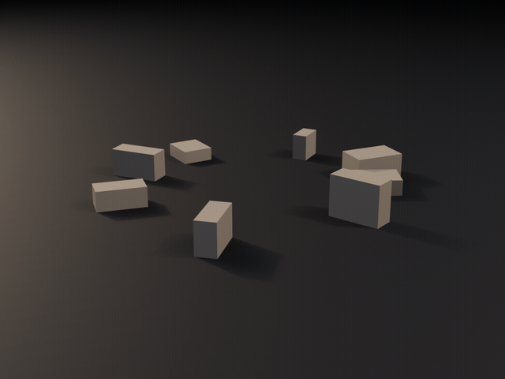
  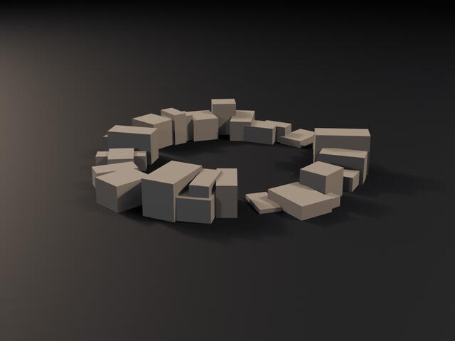
  

Cubes face inward and carry world-space UVs, so a tileable texture keeps the same density on
every cube whatever its size. On top of that: angular spacing jitter, min/max radial offset, and
min/max scale per axis (or uniform).

  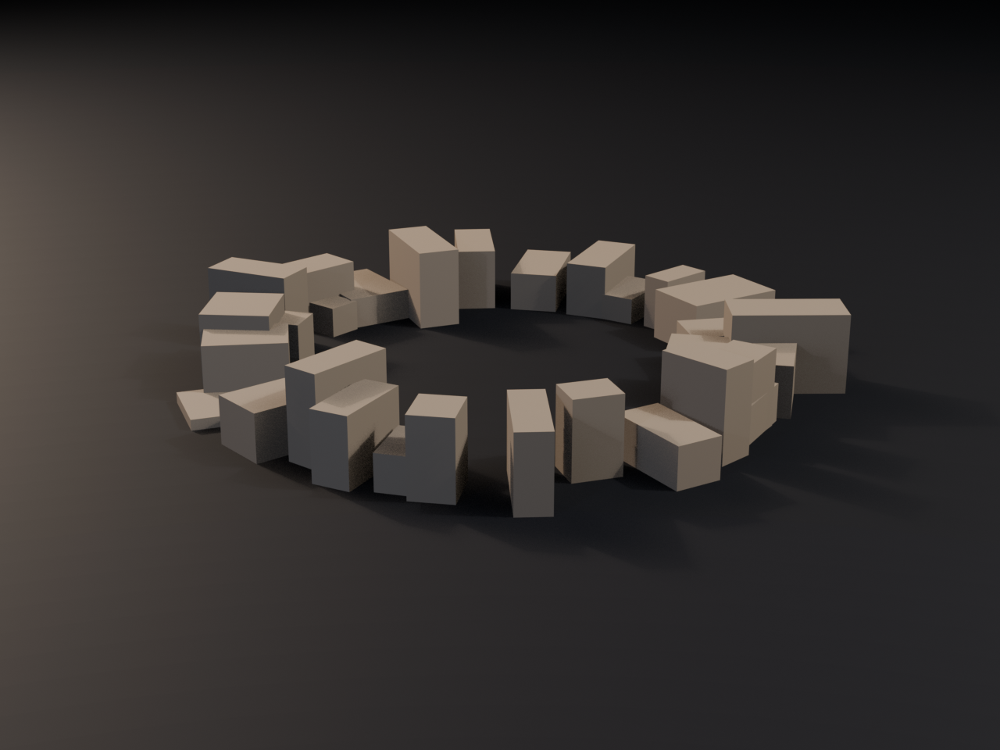
  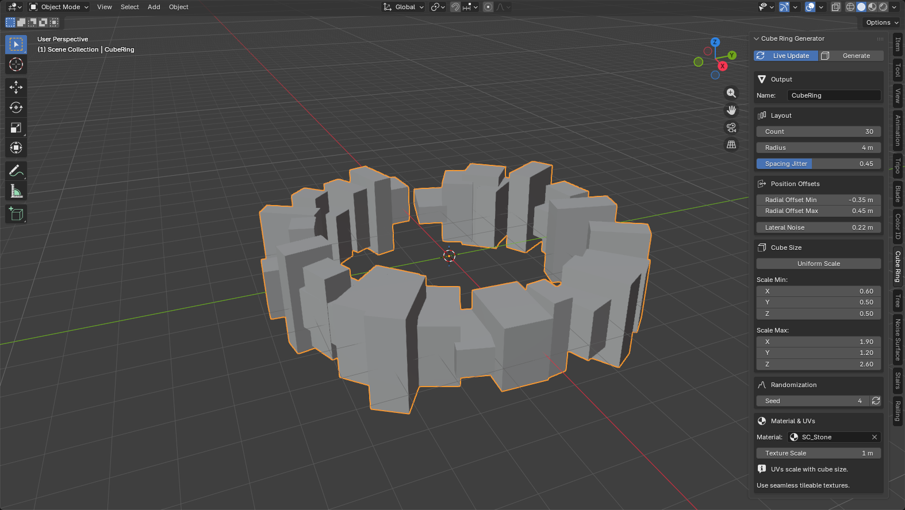

**Cube Ring** tab · `cube-ring-generator/cube_ring_generator.py` · [README](../cube-ring-generator/README.md)

---

## 6. Color ID Map Generator

One click on *Generate Color ID Map*, and here 82 UV islands are detected across 2314 faces. Every
island gets its hue, every face a variation around that hue, so you can select either a whole
part or one precise face with the same mask.

  
  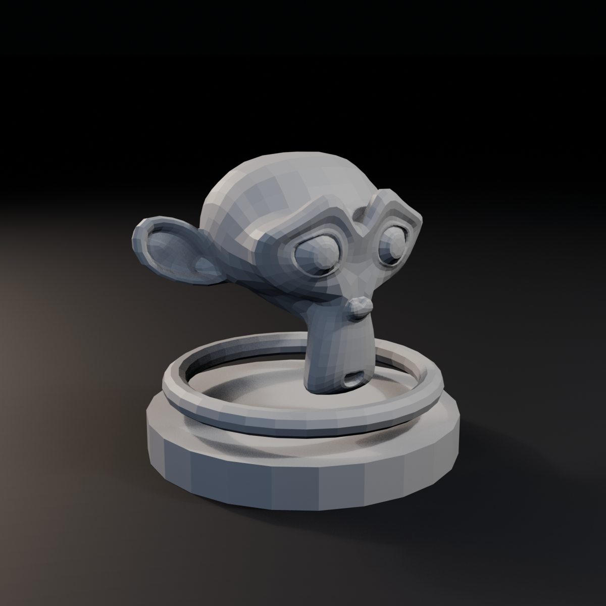
  

The texture is exported straight to PNG, up to 8K. *All Materials* bakes one map per material
slot, with a hue offset between slots so two materials never start from the same color.

  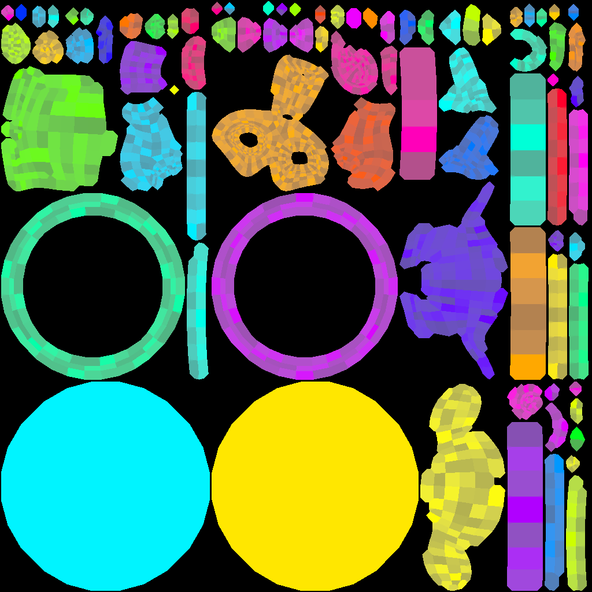
  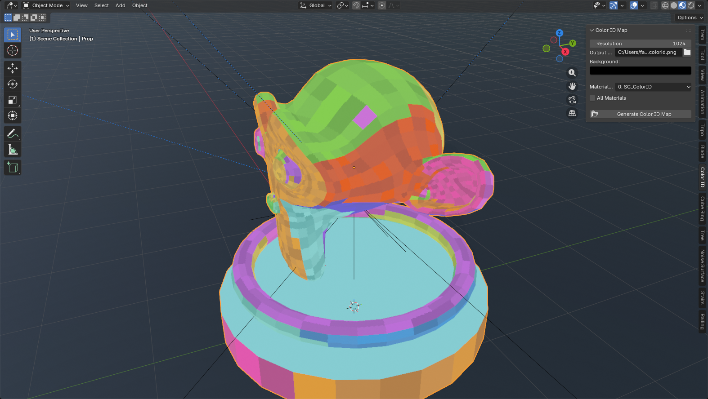

Useful to drive a material mask in Substance Painter or any texturing shader.

**Color ID** tab · `color-id-map-generator/color_id_map_generator.py` · [README](../color-id-map-generator/README.md)

---

## 7. Origin to Selection

The small tool you reach for a hundred times a day. In edit mode, `Ctrl + Alt + C` puts the
object origin at the center of the current selection, without moving the geometry, and
everything that follows (rotation, scale, snapping) pivots around that point.

  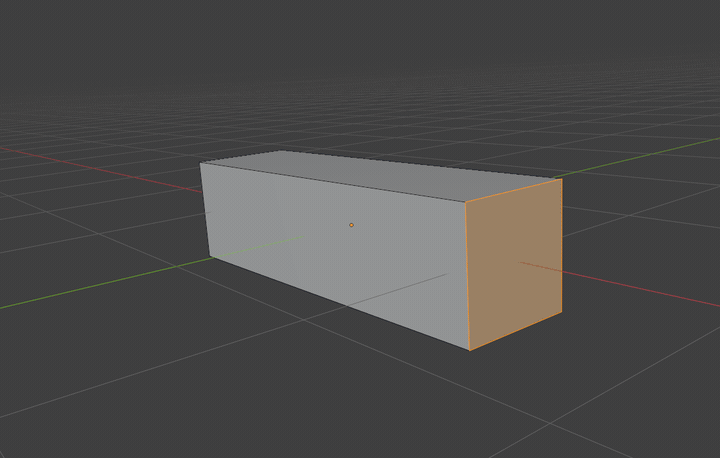
  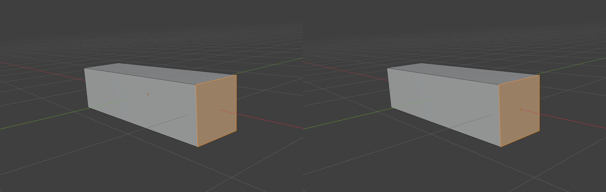

It replaces the manual sequence *3D cursor → snap to selection → object mode → origin to cursor
→ back to edit mode*, restoring the 3D cursor to where it was along the way. Also available from
the right-click menu in the 3D view in edit mode.

Extension · `origin-to-selection/` · [README](../origin-to-selection/README.md)

---

## Notes

- Renders use EEVEE, AgX view transform, three-point lighting, neutral background.
- Animations are GIFs, looping and ping-ponged where it reads better.
