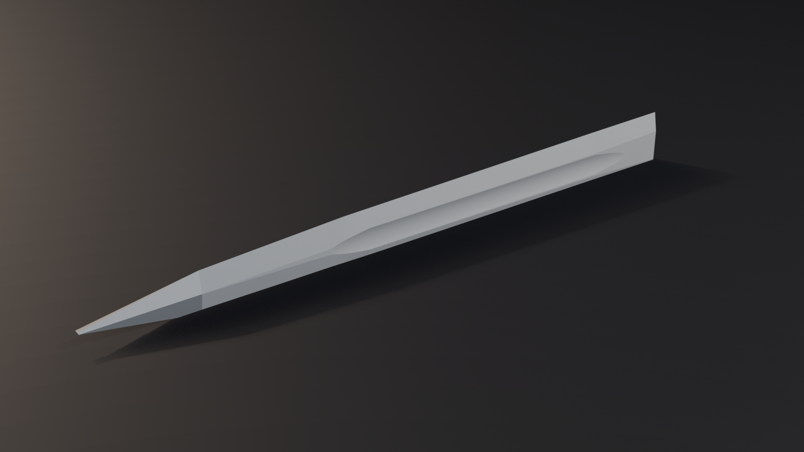
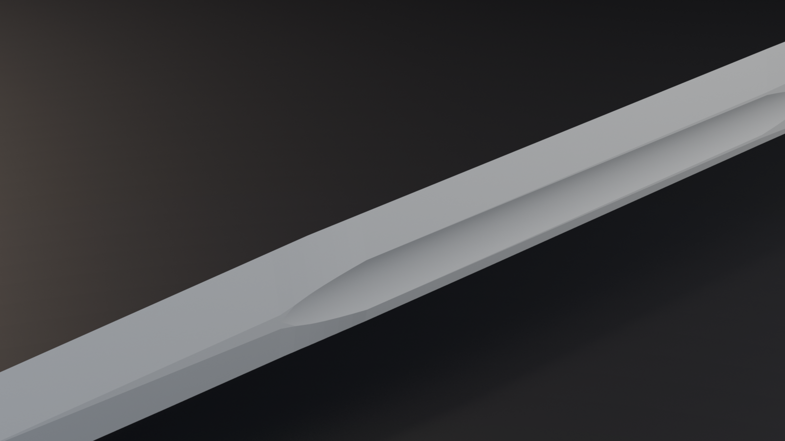
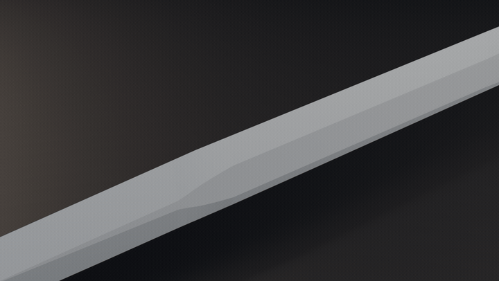
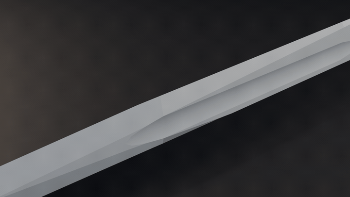
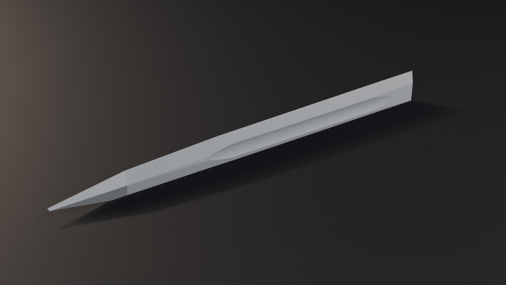
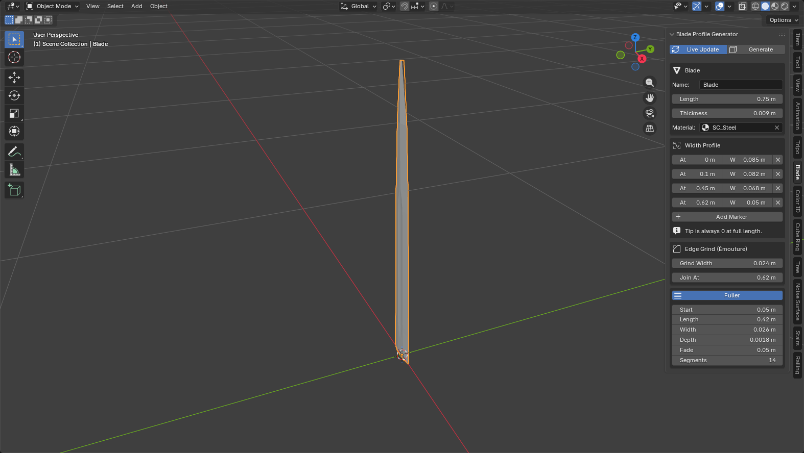

# Guide des add-ons

Sept add-ons Blender maison, tous testés sur Blender 5.1 (et compatibles 4.x selon la fiche
de chacun). Six générateurs de géométrie procédurale, un utilitaire de bake, un raccourci
d'édition.

Toutes les images de ce guide sont des rendus EEVEE réels de la géométrie produite par les
add-ons, pas des maquettes.

## Installation

Deux formats coexistent dans ce dépôt.

**Scripts `.py` (add-ons classiques)** — tous sauf Origin to Selection :

1. `Edit > Preferences > Add-ons`
2. Menu ▾ en haut à droite > `Install from Disk`
3. Sélectionner le `.py` du dossier voulu
4. Cocher la case pour l'activer

**Extension (Origin to Selection)** : zipper le dossier `origin-to-selection/`, puis
`Install from Disk` sur le zip.

Chaque add-on pose son panneau dans la *sidebar* de la vue 3D (touche **N**), sur son propre
onglet vertical. Les captures « panneau » ci-dessous montrent où regarder.

---

## 1. Stair Generator

Escalier plein, manifold, en quads partout sauf les deux flancs en n-gons. Aucun sommet
dupliqué, aucune face interne : sortable tel quel vers un moteur de jeu.

La topologie, mise en évidence : 15 marches = 64 sommets, 34 faces, dont 32 quads.

**L'angle de pente pilote le giron.** On donne l'angle, la profondeur de marche s'en déduit
(`giron = contremarche / tan(angle)`), l'escalier se réétire en direct.

**La hauteur de marche pilote leur nombre.** On donne une hauteur cible, le nombre de marches
est arrondi pour que la hauteur totale tombe juste — la contremarche réelle est donc toujours
un diviseur exact de la hauteur demandée.

Le panneau *Result* affiche les valeurs réellement construites et vérifie la formule de
confort de Blondel (2h + g entre 60 et 64 cm).

Onglet **Stairs** · `stair-generator/stair_generator.py` · [README](../stair-generator/README.md)

---

## 2. Curve Railing Generator

Rambarde + barreaux le long d'un tracé, avec une tessellation **adaptative à la courbure** :
de la géométrie dans les virages, presque rien sur les lignes droites.

On pose des points de contrôle (« la rampe va de là à là, puis tourne »), et chaque angle est
arrondi tout seul par un **vrai arc de cercle** du rayon demandé — pas une approximation de
Bézier, pas de poignées à gérer.

**Le seul réglage qui compte vraiment : `Max Deviation`.** C'est le budget angulaire d'une
section de rambarde. Plus il est bas, plus les congés sont lisses et plus il y a de triangles.
Les parties droites, elles, ne gagnent aucune subdivision quoi qu'il arrive.

Le filaire orange montre où passe la densité : concentrée sur l'arc, absente ailleurs.

Ordres de grandeur mesurés sur un tracé « long droit + virage à 90° » :

| Tracé | Sections | Triangles |
|---|---|---|
| L en angle droit, angles vifs | 4 | 320 |
| Idem, congés 0,6 m à 8° | 28 | 684 |
| Idem à 3° | 64 | 1260 |
| Bézier adaptatif à 8° | 16 | 472 |
| Le même Bézier à résolution uniforme équivalente | 161 | 2792 |

Les paramètres sont stockés **sur l'objet** : chaque barrière garde ses réglages, et Shift+D
donne une copie éditable indépendamment. Avec *Live Update*, déplacer un point de contrôle en
Edit Mode met la barrière à jour en direct.

Onglet **Railing** · `curve-railing-generator/curve_railing_generator.py` · [README](../curve-railing-generator/README.md)

---

## 3. Low Poly Hex Tree

Arbre low poly procédural : sections courbées par transport parallèle (donc aucune vrille
accumulée dans les branches), feuillage en quads, UVs en projection box.

**Branch Depth** fait pousser l'arbre niveau par niveau. 28 faces au tronc nu, 4598 à cinq
niveaux avec feuillage.

**Un seul entier change tout.** Même paramétrage, seize graines différentes.

De quoi peupler un décor sans jamais deux arbres identiques.

Chaque niveau de branchement a ses propres réglages (nombre de branches, côtés du polygone,
sections, taper, bruit de courbure), copiables d'un niveau à l'autre en un clic.

Onglet **Tree** · `low-poly-hex-tree/low_poly_hex_tree.py` · [README](../low-poly-hex-tree/README.md)

---

## 4. Noise Surface Generator

Surface déplacée par un bruit de Perlin fractal (fBm), tout paramétrable en temps réel, puis
figée en mesh standard quand le résultat convient.

**Les octaves empilent le détail.** Une octave = de grandes collines molles ; six = un relief
complet, chaque octave ajoutant une fréquence deux fois plus haute à amplitude moitié moindre.

**L'échelle règle la taille des motifs** — de la chaîne de montagnes au caillou.

**Mode seamless.** Le bruit est échantillonné sur un tore en 4D : comme un cercle se referme,
la surface est identique à ses deux bords opposés. Ici la même tuile répétée 3×3 — aucune
couture.

Onglet **Noise Surface** · `noise-surface-generator/noise_surface_generator.py` · [README](../noise-surface-generator/README.md)

---

## 5. Cube Ring Generator

Anneau de cubes de tailles aléatoires orientés vers l'intérieur, avec des UVs en espace monde
(une texture tileable garde la même densité sur tous les cubes, quelle que soit leur taille).

**Le nombre de cubes**, de 8 à 60, en gardant le rayon.

**La graine**, pour rejouer la distribution jusqu'à tomber sur la bonne.

**Le bruit latéral**, de l'anneau bien rangé au champ de ruines.

S'ajoutent le jitter d'espacement angulaire, le décalage radial min/max et les échelles
min/max par axe (ou uniformes).

Onglet **Cube Ring** · `cube-ring-generator/cube_ring_generator.py` · [README](../cube-ring-generator/README.md)

---

## 6. Blade Profile Generator

Lame d'épée construite à partir d'un **profil de largeur** : des jalons `(position, largeur)`
le long de la lame, interpolés linéairement, pointe automatiquement ramenée à 0. Plus
l'émouture (le tranchant) et la gorge (le fuller) sur les deux faces.

Le détail qui fait le boulot : la sortie de gorge arrondie et la ligne d'émouture.

**La gorge se creuse** comme le ferait une fraise ronde : la section est un arc de cercle de
rayon d'outil constant, et aux extrémités la profondeur remonte en suivant le même arc — d'où
le contour de sortie arrondi, pas une simple rampe droite.

**L'émouture est proportionnelle** : le méplat central reste une fraction constante de la
largeur locale, l'émouture suit donc le rétrécissement de la lame au lieu de garder une largeur
fixe absurde près de la pointe. À 0, le chant reste rectangulaire (lame non affûtée).

**Le profil de largeur** se règle jalon par jalon. Deux jalons à la même position créent un
décroché net — c'est comme ça qu'on fait un ricasso.

Onglet **Blade** · `blade-profile-generator/blade_profile_generator.py` · [README](../blade-profile-generator/README.md)

---

## 7. Color ID Map Generator

Bake d'une texture Color ID par matériau, à partir des îlots UV, avec une variation de teinte
par face à l'intérieur de chaque îlot. Utile pour piloter un masque de matériaux dans Substance
Painter ou n'importe quel shader de texturing.

Un objet quelconque, avec ses UV :

Un clic sur *Generate Color ID Map* — ici 82 îlots détectés sur 2314 faces :

Et la texture produite, prête à l'export (PNG, résolution au choix jusqu'à 8K) :

Chaque îlot reçoit sa teinte, chaque face une variation autour de cette teinte — on peut donc
sélectionner soit une pièce entière, soit une face précise, avec le même masque. Le mode *All
Materials* bake une carte par slot matériau, avec un décalage de teinte entre les slots pour
que deux matériaux ne partent jamais de la même couleur.

Onglet **Color ID** · `color-id-map-generator/color_id_map_generator.py` · [README](../color-id-map-generator/README.md)

---

## 8. Origin to Selection

Le petit outil qu'on utilise cent fois par jour. En mode édition, `Ctrl + Alt + C` place
l'origine de l'objet au centre de la sélection courante, sans déplacer la géométrie.

À gauche, l'origine au centre de l'objet. À droite, après le raccourci : elle est sur la face
sélectionnée — et tout ce qui suit (rotation, échelle, snapping) pivote autour de ce point.

Ça remplace l'enchaînement manuel *curseur 3D → snap sur la sélection → mode objet → origin to
cursor → retour en édition*, curseur 3D restauré à sa place au passage. Accessible aussi par
clic droit dans la vue 3D en mode édition.

Extension · `origin-to-selection/` · [README](../origin-to-selection/README.md)

---

## Notes

- Les rendus de ce guide sont faits en EEVEE, vue AgX, éclairage 3 points, sur fond neutre.
- Chaque GIF a un équivalent `.mp4` à côté (même nom) : à préférer pour un post, la qualité est
  meilleure et le fichier bien plus léger.
